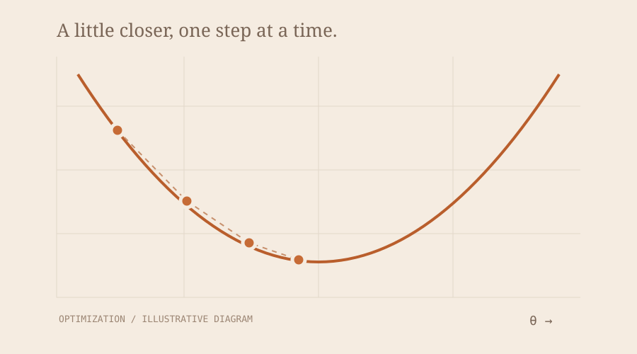

## A landscape and a direction



For a differentiable objective $f(\theta)$, the gradient points toward the direction of steepest local increase under the Euclidean norm. A basic descent step moves in the opposite direction:

$$
\theta_{t+1}=\theta_t-\eta\nabla f(\theta_t)
$$

The learning rate $\eta$ controls the size of the step. Choosing it is part of the algorithm, not an afterthought.

## A small numerical example

Take $f(x)=(x-3)^2$. Its derivative is $2(x-3)$.

```python
x = 0.0
learning_rate = 0.1

for step in range(20):
    gradient = 2 * (x - 3)
    x -= learning_rate * gradient
    print(step, x)
```

### What to watch

- The objective should be tracked alongside the parameter values.
- A step that is too large may overshoot the useful region.
- Smooth examples build intuition, but do not establish guarantees for every objective.

## A question for next time

What changes when gradients are estimated from mini-batches? The next note can compare the deterministic update with its stochastic counterpart.
