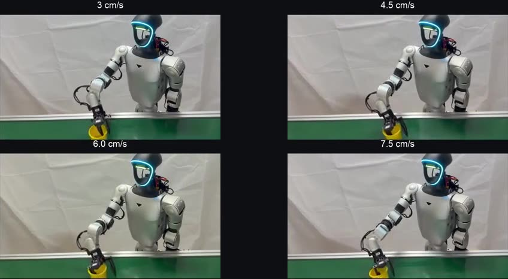
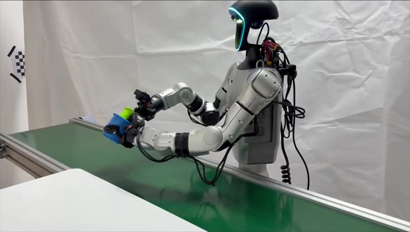
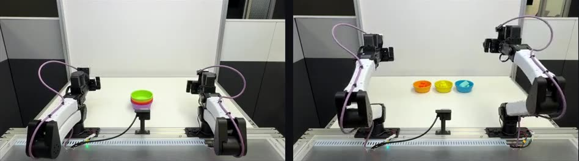

检索截至 **2026-10-09 02:02:07（北京时间，UTC+08:00）**；主窗口为 2026-10-06 02:02:07 至截止时刻，未启用七天回退。按仓库既有日报的基础 arXiv ID、标题和官方地址比对，以下两项尚未报道。Long-WAM 的 [arXiv v1 记录](https://arxiv.org/abs/2610.10528)为 10 月 7 日 17:58:04 UTC **提交**，提交时刻不能直接当作公众可读时刻；[作者代码仓库](https://github.com/NVlabs/LongLive/tree/main/Long-WAM)的发布记录标为 10 月 7 日，而 [cs.RO 新列表](https://arxiv.org/list/cs.RO/new)在 10 月 8 日列出论文，后两者分别提供日期精度的项目公开记录与论文公开证据。检索与文中数值均以论文 v1 和作者项目页为准。

## 今日精选

| 工作 | 可核实公开证据 | 关注点 |
|---|---|---|
| **首推** · [Long-WAM: Scaling the Context of World-Action Models](https://arxiv.org/abs/2610.10528) | [作者项目](https://nvlabs.github.io/LongLive/Long-WAM/)与 10 月 8 日 [cs.RO 新列表](https://arxiv.org/list/cs.RO/new) | 自回归机器人视频预训练怎样让更长观察历史真正可用，以及推理时延怎样抵消长上下文的收益。 |
| [Workhorse: Learning Robust Whole-Body Humanoid Loco-Manipulation from Human Data](https://arxiv.org/abs/2610.09117) | [作者项目及技术说明](https://hybridrobotics.github.io/workhorse/)；10 月 8 日 [cs.RO 新列表](https://arxiv.org/list/cs.RO/new) | 用无需机器人参与的人类示教训练视觉规划器与全身跟踪器，并在两者训练中模拟部署误差。 |

[Workhorse 作者项目](https://hybridrobotics.github.io/workhorse/)给出了比摘要更可核查的输入、训练与消融：五个可穿戴跟踪器记录躯干、双腕、双足的位姿，胸前相机记录视频；视觉规划器读入四张图像和过去一秒的九组五连杆位姿，以 5 Hz 输出 1.16 秒目标片段，强化学习训练的全身跟踪器执行接下来的 0.2 秒。规划器与跟踪器分别模拟对方在部署时造成的历史漂移和指令漂移。在扫描示教房间构建的仿真中，G1 箱子整理无推扰为 77/100，施加 40 N·s 推扰为 64/100；撤去规划器增强后分别为 20/100 和 0/100。作者还展示真机 G1 箱子整理、接箱和手提箱操作，但项目页未给这些真机展示统一的成功率分母；仿真消融不能直接当作真机收益。项目页当时仍写代码未发布，是否已有后续开放需以仓库现状另核。

## 长历史为什么难以变成有用的控制信号

机器人执行较长任务时，眼前画面可能不足以决定下一步：物体先前放在哪里、双手刚刚怎样接触它、容器是否已经经过一个阶段，都需要历史。把更多视频帧直接塞进策略，并不保证策略会读到有用信息。长序列会增加注意力计算，模型若只在短片段上学习，也可能在训练时根本没有形成跨阶段预测能力。Long-WAM 的问题因此是：**世界—动作模型（World-Action Model，WAM）能否在经过长视频自回归训练后，随可见历史变长而获得稳定的操作收益，并仍以可用速度闭环执行？**

论文的差异不只在延长一个视觉缓冲区。作者先把已有长视频生成器 LongLive-2.0 继续训练为机器人视频模型，再在视觉未来的条件下学习动作；部署端则用无需解码为像素的部分未来视频潜变量作为动作条件，并将较重的推理与动作执行异步重叠。它同时提出一个需分开判断的经验命题：**同样增加历史长度时，经过机器人域自回归视频预训练的模型优于从双向视频模型直接适配的版本**。这并不是所有世界模型都必然受益的证明，因为不同上下文长度在文中分别训练，而最长窗口还涉及大量补帧。

系统的输入是最近一段观测视频的压缩潜变量 $Z^-$、机器人本体状态 $q$ 和语言指令 $c$；输出是一段可执行动作 $\hat A$。先由视频生成分支在历史及指令的条件下预测可能的未来视觉潜变量，随后动作专家读取已观察历史、部分去噪的未来潜变量和本体状态，生成动作块。关键限制是信息方向不对称：视频查询只读视觉过去，不读取动作专家；动作查询可以读视频侧的历史与未来线索。这样视频缓存可供动作分支复用，而未来视觉被用作行动前的条件信息，不能误说成机器人已经看到了真实未来。

视频底座从 16 秒自回归检查点继续训练。作者汇集 RoVid-X、AgiBot World、EgoDex、EgoVerse 与 VITRA 等来源，附录列出约 229 万个文本或图像条件的视频训练样本，其中实际训练划分约 225 万个。文中“约一万小时”对应各 16 秒窗口累计的量级，**不等于一万小时互不重叠的独立真机记录**。序列训练最长覆盖约 30 秒；块因果注意力使一个带噪目标视频块读取已给出的先前真值块，模型学习从噪声恢复当前块的流匹配方向。训练中还回收模型自身生成的误差，减轻推理时把预测继续当历史所造成的偏移。仅凭这种视频预训练并不能执行动作，它提供的是一个有机器人场景动态先验的视频分支。

动作适配把视频与动作放进相邻但不完全共享的计算流。训练分两次计算：第一次优化视频生成目标；第二次在真值未来视频加噪后的潜变量上训练动作流匹配，噪声水平取 $\sigma^*=0.9$，视频缓存与该动作损失之间截断梯度，更新动作专家和本体状态适配器。示教动作块被加噪后，动作专家以视频历史、部分带噪的未来视频、本体状态和指令为条件，预测把它推回目标动作的速度；[论文 v1 的目标函数与附录](https://arxiv.org/html/2610.10528v1)给出具体时间参数化。推理时，视频分支只做四步部分生成，到相应噪声水平便把潜变量交给动作分支，不做完整视频去噪，也不解码图片。这里有一个重要的训练—推理差别：训练的动作条件来自**真值未来加噪**，部署时来自**模型预测的部分未来**。论文用消融证明这种未来条件有益，但没有消除两种条件分布不一致的问题。

## 实验揭示了收益与边界

长上下文对照把未来预测跨度和动作块长度固定，分别训练不同历史窗口的模型。GR-1 上，正文 §5.3 对机器人域自回归初始化给出 2.4 秒历史的 66.3% 与 19.2 秒的 78.7%；同文摘要和另一张表又把起点写成 63.3%。这属于**原文内部基线数字不一致**，不能将 63.3% 与 66.3% 当作两次相同控制实验的确定结论。延至 38.4 秒时成绩回落到 75.2%，且该窗口约 80.4% 为起始帧补齐、平均任务轨迹只有 12.1 秒，因此回落既不能单独证明模型记忆极限，也提醒历史窗口不等于有效信息长度。相较之下，从 Wan2.2 双向视频底座适配的对照在 2.4、9.6、19.2 秒分别为 61.7%、64.1%、61.6%，没有相同的单调长历史收益。

在 LIBERO-Long，文中报告 2.4 秒设置下 94.5% 到 99.5% 的变化；未来视觉条件的消融为无未来 94.5%、联合去噪 97.8%、文中采用的独立未来条件 99.5%。这些数字说明该基准上未来潜变量的构造方式重要，但不能推导到所有真实机器人任务。RoboTwin 2.0 的清洁场景平均 94.7%、随机化场景 94.2%，合计 94.4%；真机之外的大量比较仍是模拟环境结果。

图 A：作者[项目页面](https://nvlabs.github.io/LongLive/Long-WAM/)的真机演示封面原图，四个面板标出传送带速度 3、4.5、6、7.5 cm/s，便于读出速度条件。此图为作者项目视频素材，**不是论文中的编号图**；对应实验与分母见[论文 v1 真机实验](https://arxiv.org/html/2610.10528v1)。[作者原图](https://github.com/NVlabs/LongLive/blob/page/Long-WAM/static/images/poster_g1_speeds.jpg)。

在 G1 真机传送带抓杯实验，每个速度、每个策略各 20 次，Long-WAM 四档分别为 100%、100%、95%、90%；对比的 Fast-WAM 和 $\pi_{0.5}$ 在 6 与 7.5 cm/s 两档均为 0。另一项动态叠杯为 19/20，即 95%，两个基线均为 0/20。这些是明确分母下的任务成功率，不是跨全部场景的总胜率；同一论文没有在真机上完整地逐档消融可用历史长度。YAM 双臂平台的三项较长任务各 20 次，砖块整理、饺子装盒、碗堆叠分别 80%、80%、85%，平均 81.7%。

图 B：作者[项目页面](https://nvlabs.github.io/LongLive/Long-WAM/)的视频封面展示 G1、传送带与叠杯接触场景，帮助辨认“动态叠杯”究竟测什么。它是**无论文图号的项目原图**，不能凭单帧判定成功；19/20 来自[论文 v1 的逐次评估](https://arxiv.org/html/2610.10528v1)。[作者原图](https://github.com/NVlabs/LongLive/blob/page/Long-WAM/static/images/poster_g1_cup_stacking.jpg)。

图 C：作者[项目页面](https://nvlabs.github.io/LongLive/Long-WAM/)的双臂演示封面原图，左右呈现同一工作台的两个时刻；可看清双臂、容器与摄像头布局。它是**无论文图号的项目原图**，只说明实验装置，不代表三个任务的成功率分布。[论文 v1 真机任务](https://arxiv.org/html/2610.10528v1)；[作者原图](https://github.com/NVlabs/LongLive/blob/page/Long-WAM/static/images/poster_yam_long_horizon.jpg)。

真正阻碍长历史上机器的是时延。推理时采用异步块执行：当一块动作尚在执行，就启动下一块的生成；新块就绪后按时间戳切换，缓存复用视频侧的键值状态，并在前一块运动期间持续编码新到的视频。若已可执行部分与下一次触发之间的重叠时长为 $O\Delta t$，下一块的就绪时间 $T_{\rm ready}$ 至少需满足 $T_{\rm ready}\le O\Delta t$，才能在该调度设置下避免等候。这个条件解释了“生成一个动作块的时延”与“每次控制更新的周期”为什么不能混为一谈。视频专家的 NVFP4 权重与激活、BF16 动作专家和缓存、CUDA Graph 等共同改善系统性能，量化并非无代价。在 RTX 5090 上，论文报 BF16 eager 为 356.0 ms、优化的 V4/A4 为 107.4 ms、V2/A2 为 81.8 ms；对应 RoboTwin 平均成功率依次为 94.4%、93.5%、92.5%。同一设备的 2.4 秒上下文为 107.4 ms，19.2 秒增至 341.0 ms，约 3.2 倍。不能只摘最快一档而忽略精度变化，也不能把 107.4 ms 当作任意上下文长度或硬件上的保证。

作者还把 WAM 放进 RoboCasa365 的高层规划系统：由语言模型产生子目标，操作策略完成底层动作。论文给出的 50 项任务总成功率由 31.4% 到 54.4%，但这是**规划器与底层策略共同组成的系统**，不可归因于 Long-WAM 单项改动。整体看，论文较有说服力的贡献是把长视频训练、未来视觉条件、动作生成和实时调度串为可运行系统，并用短/长历史、不同初始化和条件方式的对照揭示何时有效。主要外推边界仍在训练与硬件成本、分上下文重新训练、真机试验规模，以及长历史在真实部署中是否独立产生收益。作者给出了[项目与代码入口](https://github.com/NVlabs/LongLive/tree/main/Long-WAM)，但复现完整视频底座、跨平台数据和真机时序仍需要额外资源。

**图片核验说明：**本次取得并逐张打开了作者项目中真实的 G1 与 YAM 实验封面图，核对了面板、分辨率和对应任务。作者项目仓库未找到这篇论文的整体框架或关键方法原图；arXiv 图片读取在本次云端浏览器遭已保存权限设置拒绝，因此这里没有把项目封面冒称论文方法图。图文核验在**方法框架原图**这一项仍未完成。
