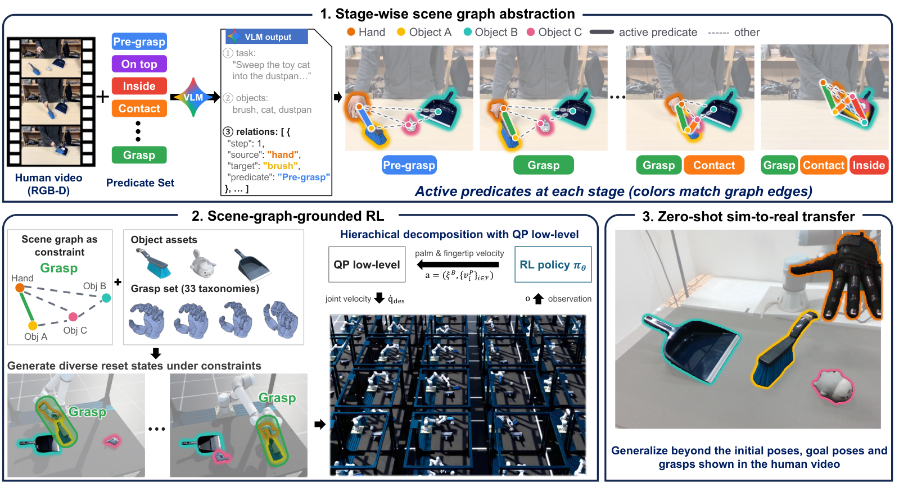
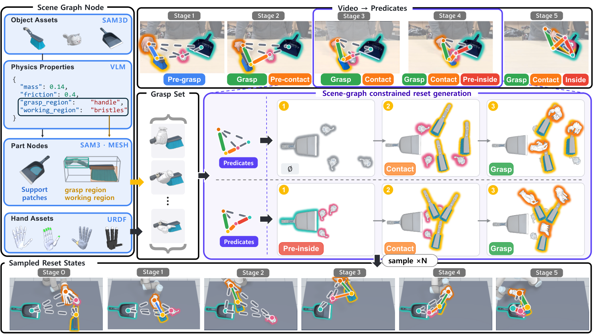
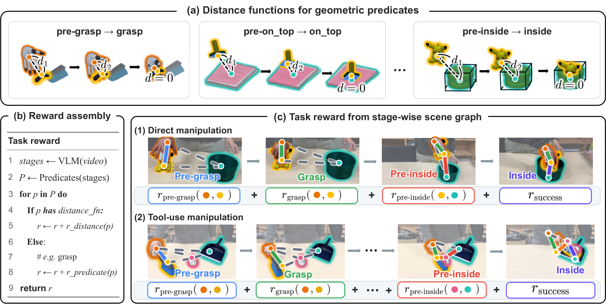
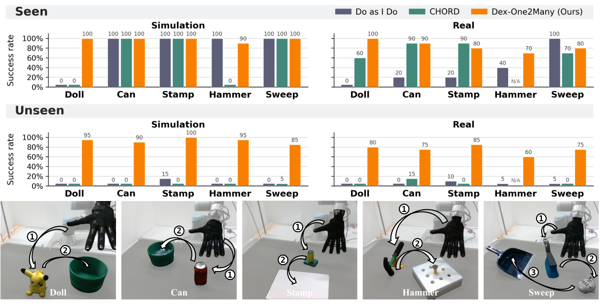

本轮实际启动记录及检索截止 $T$：2026-10-10 02:11:00 +08:00；覆盖 2026-10-07 02:11:00 至该时刻，采用近 72 小时窗口，未回退七天。

## 今日精选

| 工作与来源 | 可核验公开日期 | 方法 | 阅读重点 |
|---|---|---|---|
| **首推** · [Dex-One2Many](https://arxiv.org/abs/2610.12470) | 2026-10-09，arXiv 新发布列表 | 场景关系抽象、阶段初始化、强化学习 | 一段视频怎样定义一批任务等价的训练状态，而非一条必须跟随的轨迹。 |
| [Generative Neural Retargeting for Human-to-Robot Dexterous Manipulation](https://arxiv.org/abs/2610.12440) | 2026-10-09，arXiv 新发布列表 | 条件流匹配、物理重定向 | 把已经优化好的轨迹变成可复用的采样先验，摊薄新示教的优化成本。 |

第二项简称 GNR（Generative Neural Retargeting，生成式神经重定向），由共同第一作者 Dechen Gao、Yue Yang 等完成，署名机构包括 Meta Reality Labs Research、UC Davis、UNC Chapel Hill、UC Berkeley、MIT 和 CMU。它保留人类运动参考，先用模型预测控制（Model Predictive Control，MPC）生成种子数据，再让条件流匹配模型学习相对逆运动学参考的控制残差。推理时生成多个候选，在仿真中验证，或作为 MPC 的初始化。其“多次采样至少一次成功”是离线数据生成口径，不能解释成真机单次执行成功率；长时精密任务仍需要反馈优化。与首推的区别很清楚：GNR 学习更经济地重定向示教，Dex-One2Many 则主动舍弃示教轨迹，把任务关系交给强化学习求解。[GNR v1 §3–5](https://arxiv.org/html/2610.12440v1#S3)；[官方项目](https://yy-gx.github.io/GNR/)目前提示更多内容待发布。

## 为什么单段视频不应只变成一条参考轨迹

Dex-One2Many 的共同第一作者为 Jusuk Lee、Sungha Kim、Yeonsoo Park，工作来自 Seoul National University、University of Maryland, College Park、All Purpose AI 与 KAIST；机构依据[论文 v1 首页署名](https://arxiv.org/pdf/2610.12470v1#page=1)。[项目页](https://dex-one2many.github.io/)已提供演示，但代码入口仍标为 Coming soon。

考虑“拿起刷子，把玩具猫扫进簸箕”。若把人类视频重建成手腕、指尖和物体轨迹，再奖励机器人跟随这些轨迹，机器人很容易学到视频里那一次执行。可是簸箕换到另一侧时，刷子的接近方向、手的握法和扫动路径都可能需要改变；此时坚持原轨迹，反而把正确的新解排除在外。直接取消轨迹约束又不够：多指手必须先接近、抓稳、让刷毛接触玩具，再控制推移，随机探索很难连续完成这些步骤。

论文把这两个困难连起来处理：从视频中保留“哪些关系必须成立、先后顺序是什么”，把位置、抓法和运动路径留给策略学习。比如扫动任务需要手抓刷子、刷子接触玩具、玩具进入簸箕，却不要求手腕经过某个示教坐标。一个关系描述对应许多合法场景；这些场景既扩大训练覆盖，也能作为中间阶段的起点，让策略在还不会抓刷子时先练习扫动。这比仅给一条轨迹加位置扰动更进一步，因为握法与执行路径也可变化。[§1–3](https://arxiv.org/html/2610.12470v1#S3)

## 从视频关系到可训练、可执行的策略

*图 1｜原文 Figure 2，整体方法框图。上方先将视频变成手—刷子—玩具—簸箕的关系序列；左下结合物体资产和抓取集合生成不同阶段的训练起点，中下由策略输出手掌与指尖速度，经低层控制器执行；右下是真机迁移。场景图同时决定状态采样、观测与奖励，不能只把它理解成语言规划器输出的一张待办表。来源：[论文 v1 Fig. 2](https://arxiv.org/html/2610.12470v1#S2.F2)、[官方 HTML 原图](https://arxiv.org/html/2610.12470v1/overview.png)，CC BY 4.0，原图未改绘。*

### 关系抽象：留下任务约束，把语义落实到几何

输入是一段示教以及预定义的谓词词表。谓词可以理解为可检验的关系，如 grasp（抓住）、contact（接触）、inside（进入容器）；相应的 pre-grasp、pre-inside 描述接近但尚未满足的关系。视觉语言模型（Vision-Language Model，VLM）识别对象、功能部位和关系建立顺序，输出结构化描述，再形成分阶段场景图。节点包含手、物体和功能部位，边表示关系。附录中的实际提示要求模型列出已经建立的关系，接近阶段由流程补出；它不是让模型逐帧生成机器人动作。[§3.1、附录 B.1–B.2](https://arxiv.org/html/2610.12470v1#A2)

“抓刷柄”还不能直接交给物理仿真。流程用第一帧的 RGB、分割掩码和深度提供的米制点图重建网格，部分物体直接使用 CAD 资产。功能部位先由模型命名，再从网格多个渲染视角分割、反投影与融合，得到抓取区域和工具工作面。抓取区域限定手可以握在哪里，刷毛工作面则限定怎样接触玩具。质量、摩擦来自单独的语言模型估计，并在训练中随机化。因此“单视频”并不意味着只需任意互联网 RGB 片段，也不意味着完全免资产准备。[附录 B.3–B.4、Table 2/4](https://arxiv.org/html/2610.12470v1#A2.SS3)

策略观测按角色拼接本体状态、物体几何及六维位姿、功能区域和相对位姿。相对位姿的端点由谓词决定：可以是指尖与抓取区域，或工具工作面与目标，而不只是两个物体中心。图的贡献在于系统化地构造这些特征；本文策略并非在线接收任意拓扑的通用图神经网络，也不直接读取原始相机图像。[§3.2、附录 C.1](https://arxiv.org/html/2610.12470v1#A3.SS1)

### 阶段初始化：让后半段任务先变得可练习

*图 2｜原文 Figure 10。左列提供物体几何、物理参数、功能区域和机器人手；中列提供候选抓法；右侧两行展示不同阶段怎样逐次放置实体。上行先放玩具，再放与之接触的刷子，最后放持刷子的手；下行增加“玩具接近簸箕”后，簸箕成为放置的锚点。底行是由相同关系生成的阶段起点示例。来源：[论文 v1 Fig. 10](https://arxiv.org/html/2610.12470v1#A3.F10)、[官方 HTML 原图](https://arxiv.org/html/2610.12470v1/stage_generation_overview.png)，CC BY 4.0，原图未改绘。*

一个阶段只规定关系，采样器便可以先放置锚点对象，再沿依赖关系安排其它实体。例如已抓住刷子并接触玩具的阶段，先采玩具位置，再让刷毛落到接触区域，最后把手放在刷柄上的合法抓姿；不受当前关系约束的簸箕可以放在剩余空间。加入“接近簸箕”以后，必须从簸箕向外依次安排玩具、刷子与手。这里扩充的是满足任务结构的状态集合，不是随机把几个物体扔到桌上。[附录 C.3.1](https://arxiv.org/html/2610.12470v1#A3.SS3.SSS1)

抓姿由 Dexonomy 按手型和物体几何合成，并限制在功能抓取区。但“握得稳”不等于“做得完”：抱住整个玩具也许很稳，却可能让手指在入桶时撞桶沿。作者因此检查各类抓法在后续阶段的兼容性，保留通过比例较高的四类；阶段状态从目标往前生成，继承后继阶段已验证的锚点和抓法。碰撞、静置稳定性及预先进行的外力抓取检验过滤候选，每阶段保留 10,000 个状态。终态先生成满足目标的状态，再扰动成接近目标的起点，避免一复位就成功。[附录 C.3.2–C.3.3](https://arxiv.org/html/2610.12470v1#A3.SS3.SSS2)

复位还有一个关键细节：除了设置手指实际关节位置，还恢复闭合指令 $q_{\mathrm{cmd}}$，让控制器从第一步就持续施加保持抓握所需的作用。只摆出相同几何姿态，接触力未必存在，物体仍会滑落。训练均匀选择各阶段起点，策略可以分别练习抓取、接触和推移，再学会把它们连起来；正式评估则统一从空手开始完成全任务，不借用中途复位。

### 奖励与执行：关系怎样变成学习信号

*图 3｜原文 Figure 3。(a) 将空间关系落实到指尖、工作面或容器区域的距离；(b) 按谓词装配奖励；(c) 同一装配规则用于直接放置和工具操作。图中的距离示意不能替代抓稳判据：grasp 还需要下面的力旋量空间评价。来源：[论文 v1 Fig. 3](https://arxiv.org/html/2610.12470v1#S3.F3)、[官方 HTML 原图](https://arxiv.org/html/2610.12470v1/scene_graph_for_RL.png)，CC BY 4.0，原图未改绘。*

空间关系先变成距离，例如物体参考点到容器内部区域的距离。密集奖励计算“是否比本回合此前最好的一次更接近”，以 pre-grasp 为例，附录 C.2 的表达是：

$$
r_{\mathrm{pre\text{-}grasp},t}(A,B)
=\max\bigl(d^{*}_{AB,t-1}-d_{AB,t},0\bigr).
$$

其中 $A,B$ 是关系涉及的两个实体，$d_{AB,t}$ 是当前几何距离，$d^{*}_{AB,t-1}$ 是此前达到的最小距离。奖励只在创造新的接近进展时为正，停在目标附近不会持续得分，后退再回到旧位置也不能重复刷取这部分奖励。其它距离谓词沿用相同构造，工具接触还加入工作面的方向对齐。[附录 C.2](https://arxiv.org/html/2610.12470v1#A3.SS2)

抓取需要不同信号。作者沿用 CHORD 的力闭合评价：将接触摩擦锥离散成候选接触力，再把力和力矩组成六维力旋量，检查它们对采样方向的支撑。仅提高受支撑方向的比例仍可能出现“用刷子顶住玩具”的取巧行为，因此又奖励最弱方向的支撑，并要求至少两个不同手指接触。原文式 (1)–(2) 为：

$$
\begin{aligned}
Q_t&=\min_j\sigma_{j,t},\\
r_{\mathrm{grasp}}(o_t,a_t)
&=r_{\mathrm{fc}}(o_t,a_t)
+\mathbb{I}[N_{\mathrm{finger},t}\geq2]\max(Q_t,0).
\end{aligned}
$$

这里 $o_t,a_t$ 是观测与动作，$\sigma_{j,t}$ 为第 $j$ 个采样力旋量方向的支撑，$Q_t$ 衡量最薄弱方向；$r_{\mathrm{fc}}$ 是支撑超过阈值的方向比例，$N_{\mathrm{finger},t}$ 是接触手指数，$\mathbb{I}$ 为条件成立时取 1 的指示函数。其作用是让“碰上了物体”进一步变成能稳定保持的多指抓握。

完整奖励也不是无条件把所有阶段相加。原文式 (5) 用当前持物状态门控抓取后的任务奖励：

$$
r_t=\sum_{i\leq g}r_{i,t}
+\mathbb{I}_{\mathrm{hold},t}\sum_{i>g}r_{i,t}
+r_{\mathrm{success},t}+r_{\mathrm{reg},t}.
$$

$g$ 是首次包含抓取关系的阶段，$r_{i,t}$ 是该阶段的谓词奖励，成功项提供终态奖励，正则项惩罚过大动作和关节速度。持物指示要求至少两指接触、$Q_t>0$，且物体相对起始高度抬升超过 5 cm；抓取阶段还含尚未满足持物条件时的抬升奖励。这样先鼓励可靠拿起，再允许后续操作取得收益。这里存在预定义谓词、几何判据和奖励库的工程设计；VLM 的作用是选择并组织它们，而非凭空发明一套接触控制目标。[附录 C.2，式 (3)–(5)](https://arxiv.org/html/2610.12470v1#A3.SS2)

随后用近端策略优化（Proximal Policy Optimization，PPO）训练非对称 actor–critic：critic 可读仿真特权状态，actor 只读部署可获得的几何和本体观测，并用长短期记忆网络（Long Short-Term Memory，LSTM）处理历史。仿真频率为 120 Hz、策略频率为 10 Hz，每回合 16 秒；训练还随机化物理参数、感知误差与延迟。默认 49,152 个并行环境说明其“少示教”与“大量仿真”可以同时成立。[附录 C.5、Table 9–10](https://arxiv.org/html/2610.12470v1#A3.SS5)

策略输出基坐标系下的手掌六维速度，以及掌坐标系下每个指尖的三维线速度，五指手共 21 维。低层二次规划（Quadratic Programming，QP）借助雅可比把它们映射为关节速度，在跟踪误差与速度正则之间权衡，同时约束关节位置、速度和碰撞间距。指尖速度相对手掌定义，因此相应目标只控制手指关节。部署时可收紧限速或增加手—桌间距约束，无需重新训练策略。[附录 C.4，式 (6)–(8)](https://arxiv.org/html/2610.12470v1#A3.SS4)

真机每一步由双 RGB-D 相机和 FoundationPose++ 估计物体位姿，用各视角的渲染深度与实际深度一致性加权融合，再构造同样的观测、运行 actor、求解 QP 并执行。低可信视角会被排除；双视角同时失效时只短时外推，之后保持估计。VLM 用于离线任务抽象，不在这个控制回路里重新分析视频。训练所用的接触力奖励也不意味着部署必须具备对应触觉传感器。[§3.3、附录 D](https://arxiv.org/html/2610.12470v1#A4)

## 实验说明了什么

*图 4｜原文 Figure 4，本文唯一实验图。底行依次展示玩偶入容器、罐子入桶、盖章、敲钉与清扫的任务设置及动作顺序；上方区分 Seen/Unseen 与仿真/真机。N/A 是硬件故障造成的缺失，不能按零成功处理。来源：[论文 v1 Fig. 4](https://arxiv.org/html/2610.12470v1#S4.F4)、[官方 HTML 原图](https://arxiv.org/html/2610.12470v1/real_world.png)，CC BY 4.0，保留完整原图面板。*

真机采用 UR3、20 自由度 Wuji 1 和两台 RealSense D435i。每方法、每任务的评估方案为已见配置 10 次、未见初始/目标位姿 20 次，均从空手开始、无真机微调。Dex-One2Many 在五项未见配置任务中分别成功 16/20、15/20、17/20、12/20、15/20，按图中成功率和每项 20 次试验折算，合计 75/100；可用基线单项不超过 3/20。但已见配置并非全面领先，如盖章为 8/10，CHORD 为 9/10。其主要证据是扩大空间适应范围，而非处处提高成功率。[§4.1–4.2、Fig. 4](https://arxiv.org/html/2610.12470v1#S4.SS2)

Sweep 仿真消融中，2,000 次 PPO 更新后完整方法超过 90%，取消阶段初始化约 16%，取消密集奖励一直为 0%，不恢复闭合指令约 48%。这支持初始化、进展信号和接触保持共同解决探索困难。并行环境减半后同更新数的表现也明显下降，但总采样量同时下降，不能据此单独归因于“并行度”。原文未清楚报告这些曲线的多随机种子置信区间。[§4.4、Fig. 7](https://arxiv.org/html/2610.12470v1#S4.SS4)

## 结论的边界与复现状态

这里的泛化主要发生在同一任务的不同场景配置和抓法中。四种手型实验分别训练策略，证明流程可迁移，尚不能证明一个共享策略能直接操作新手型或解决任意新任务。重建还依赖深度、可用网格及预定义谓词；关节物体需要人工资产，遮挡和几何误差继续影响真机表现。初始化检查减少不合理状态，却不是任意连续接触任务可达性的形式证明。[§4.3、§5、附录 B–D](https://arxiv.org/html/2610.12470v1#S5)

截至本轮核查，论文、附录与项目演示可读，官方代码仍待发布，尚不能声称已完成端到端复现。它最值得保留的方法认识是：视频可以提供任务成立的关系条件，关系条件又能同时组织训练起点和奖励；机器人因此有机会学会新的执行方式，而不被一次人类演示的具体轨迹锁住。

## 来源与首发核验

| 工作 | 可核验公开证据 | 提交记录与版本 |
|---|---|---|
| Dex-One2Many | [arXiv cs.RO 列表](https://arxiv.org/list/cs.RO/recent)本轮归于 2026-10-09 新发布批次；已核查[官方项目](https://dex-one2many.github.io/)及[项目页仓库](https://github.com/dex-one2many/dex-one2many.github.io) | [v1](https://arxiv.org/abs/2610.12470v1)提交于 2026-10-08 17:59:58 UTC，即北京时间 10-09 01:59:58；提交时刻不等同实际公开时刻。 |
| GNR | [arXiv cs.RO 列表](https://arxiv.org/list/cs.RO/recent)本轮归于 2026-10-09 新发布批次；交叉读取[官方项目](https://yy-gx.github.io/GNR/) | [v1](https://arxiv.org/abs/2610.12440v1)提交于 2026-10-08 17:57:58 UTC，即北京时间 10-09 01:57:58；未将该时刻写成公开时刻。 |

两项均未发现早于窗口的可证实官方公开记录；列表日期只按日期精度记录，不补造发布时分秒。已按基础 arXiv ID、对应 DOI、标题和官方地址与仓库历史原稿及公开副本去重。本轮检查 arXiv cs.RO/cs.LG/cs.CV 列表，并检索 OpenReview 与会议/机构线索；入选依据回到论文正文、署名及作者来源。搜索工具读取两项项目页时返回 Internal Error，随后经普通云端 HTTP 成功重新读取两项官方页面，并逐一核对四张 HTML 原图与本文图片的原始字节一致；浏览器打开首推项目页另发生工具超时。OpenReview 与会议检索未形成额外入选项，本轮不宣称已穷尽窗口内的全部成果。

首推阅读全文与附录，方法主要定位于 §3、附录 B/C/D，结果定位于 §4、Fig. 4/7。四张配图均来自 arXiv v1 HTML 原图，已解码并逐张打开核验文字与完整面板；[论文许可](https://creativecommons.org/licenses/by/4.0/)为 CC BY 4.0。机构以 PDF 首页为准：项目页未列出 PDF 中 Furong Huang 的 All Purpose AI 联合署名。本文没有使用 GNR 图片。
