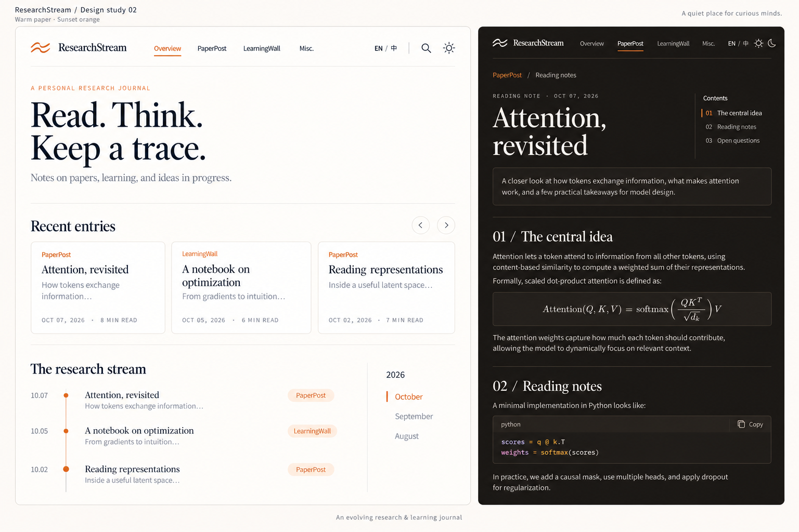

# ResearchStream — UI 与实现方案 v0.1

日期：2026-10-07。状态：待用户确认，尚未开始网站功能开发。

## 1. 目标与当前边界

做一个长期积累研究阅读、学习笔记与日常记录的个人博客。四个主导航固定为 **Overview / PaperPost / LearningWall / Misc.**，阅读、检索、内容组织优先。第一阶段静态发布、Markdown 驱动；每日内容可以由自动化更新。在线写作先保留设计与数据接口，后续按需要实现。

本轮交付视觉概念图、页面结构、内容约定和开发顺序，等待用户确认 UI 与方案后开始实现。遵循项目 `coding_protocal.md`：简单直接、不提前堆叠后端、不伪造可用功能、阶段验证和记录变更。

### 参考访问情况

- [站酷参考](https://www.zcool.com.cn/work/ZMTg1MjM1NDg=.html)：网页读取返回验证页面，浏览器加载超时；未看到作品，不声称已复刻其布局。
- [个人主页仓库](https://github.com/Jiang-524/Jiang-524.github.io)：用户将仓库设为可见后已成功读取 `src/styles.css`、`App.tsx`、`Navigation.tsx` 和 `NewsPanel.tsx`。最终提案采用其真实日落橙主题。
- 用户补充源码可能在 Windows E 盘。当前 Linux 没有 `/mnt/e`，也没有已连接的 Windows ShellCore 设备，尚不能读取。
- 现工作目录只有 `coding_protocal.md`，没有现有网站实现。

下述色板已按主页源码校准。保留固定导航、主题切换、滚动近况、日期元数据和论文图文条目的设计语言；研究博客增加独立文章、检索和 Markdown 管理，不机械搬入主页的履历/荣誉/访客统计。示例论文、日期和阅读时长仅用于设计展示。

## 2. 视觉方向：个人研究手记

使用安静的杂志式排版：大标题、细线、节制的卡片和充足留白。信息密度保持适合长期阅读。横幅仅放简短介绍，预留空间，但本期不放大图。



图由内置 imagegen 生成并根据主页源码编辑；最终修改提示词保存在 `image-prompt-v2.txt`。这是风格概念，不是可点击原型或运行截图。正式实现的摘要须严格单行省略。早期蓝色草案 `researchstream-design-v1.png` 仅保留为版本记录，以 v2 暖橙稿为当前提案。

| 视觉变量 | 浅色 | 深色 |
| --- | --- | --- |
| 页面底色 | 奶油白 `#FEFAF5` | 暖黑 `#1A1816` |
| 卡片底色 | `#FFFFFF` | `#24211E` |
| 正文 | `#1A1A2E` | `#EEE8E0` |
| 辅助文字 | `#555770` | `#C4BEB4` |
| 强调色 | 日落橙 `#E07B3C` | 浅橙 `#FF9F6E` |
| 边线 | `#E8E2DA` | `#3A3430` |

色值来源：[主页 styles.css](https://github.com/Jiang-524/Jiang-524.github.io/blob/main/src/styles.css)。橙色用于点缀和状态；浅色模式小字号链接需选更深橙并验证对比度，不直接把装饰色用作所有文字色。

- 延续主页 Inter 正文、JetBrains Mono 代码字体，补齐中文系统字体栈；作为博客的视觉调整，大标题拟使用衬线体，中文可选思源宋体/系统宋体。必要字体本地托管以支持离线。
- 正文 17–18px、行高约 1.8，阅读列宽约 720px；辅助标签 14px，日期元数据至少 12px。
- 整站最大宽度约 1200px，边距随屏幕收缩。卡片圆角约 8–12px，无强阴影。
- 桌面保留四个顶部入口；移动端保持四个入口可见并合理换行，筛选栏和文章目录收起为可展开控件。
- 图中的首页文案中文版本暂定：“阅读、思考，留下轨迹。”／“记录论文、学习，以及尚在生长的想法。”

## 3. 页面结构与交互

### Overview

1. 顶栏：站名、四个导航、全站搜索、中文/English、浅色/深色/跟随系统。
2. 文字横幅：简介和留白，后续能插入图片，本期不显示空白图片框或大面积占位骨架。
3. 最近记录：按发布时间倒序的横向卡片轨道，桌面约三张，移动端一张加下一张边缘；提供左右箭头、触摸滑动和键盘操作。默认手动滚动，避免读卡片时自动移走。
4. 时间流：按年/月分组、日期倒序列出论文与笔记；右侧月份导航跳转到对应分组。小屏改为月份选择器。
5. 首页卡片和时间流共用同一内容来源，不手工维护第二份数据；没有 Misc. 内容时不造示例记录。

### PaperPost

以可检索的文章列表为主，正文无图也成立。

```text
PaperPost / 论文速递
[搜索标题、摘要、正文、作者、DOI…             ]
[主题] [标签] [年份/月份] [语言] [排序] [清空]
主题/系列导航           文章条目列表
  主题 A                分类 · 日期 · 阅读时间
  主题 B                标题                         [有图时缩略图]
                        一行灰色 abstract…
                        标签
```

- 层级：板块 → 主题/系列 → 文章；系列中可以设定明确顺序。
- 检索：标题、摘要和正文全文检索；论文附加作者、DOI/arXiv 元数据。默认按日期倒序；搜索时按相关度，可切换最新。
- 筛选：主题、标签、年份/月份、内容语言；显示命中数量和清空入口。搜索与筛选状态写入 URL，打开文章再返回时保留。
- 零结果说明当前条件，并提供清空筛选；有内容后再显示对应分类，不生成空分类树。
- 日报和单篇阅读笔记均可用同一文章模型。若现有自动化每天输出一篇汇总，先原样作为一篇日报导入，目录链接其各篇论文小节，不强制拆分；如需每篇论文独立筛选，再调整源输出。

### LearningWall

用笔记卡片网格呈现“墙”，提供与 PaperPost 一致的搜索、主题、标签和时间筛选，侧边可以切换学习主题与系列。

- 有图片：取正文第一张有效内容图片作缩略图，排除徽章等非内容图；用统一比例裁切，正文保留原图比例。
- 无图片：不加假封面；卡片显示标题、单行灰色 abstract、日期和标签，以字体和留白组织。
- 两种卡片使用规则网格和稳定的阅读顺序，不采用复杂瀑布流。
- 卡片摘要必须来自独立 `abstract` 字段，超长使用 CSS 单行省略，不截断文章正文；进入文章可读完整摘要。
- 系列笔记提供上一节、下一节；其他文章提供上一条、下一条。

### 文章阅读页（两个板块共用）

面包屑 → 标题 → 日期/主题/阅读时间 → 完整摘要 → 正文。桌面右侧固定目录；小屏顶部展开目录。目录跟随当前章节，锚点避免被顶栏遮挡。

Markdown 验收覆盖：H1–H6、段落、列表/任务列表、引用、链接、图片与图注约定、表格、脚注、代码高亮和复制、行内/块级数学公式。长公式、代码和宽表格在局部横向滚动，不撑破页面。图片相对路径在内容目录中解析并参与构建。

第一版使用普通 Markdown，不要求用户写组件；禁止不受信任文章执行脚本。论文 DOI/arXiv 等来源链接独立展示。每日自动阅读与人工补充可以用明确来源字段区分，避免把自动生成笔记包装成已人工核验的结论。

### Misc.

导航和页面名称始终为 **Misc.**。第一版空页面保持留白，仅有必要导航，不加入虚构日常文章、计数或照片。

### 中英切换与主题

- UI 文案支持中文/英文；四个主导航按用户指定保留英文，中文页面标题补充说明；Misc. 保持英文名。
- 内容语言与界面语言分开。切换界面不擅自机器翻译原文；有成对译文时切换到对应文章，否则保留原文并注明其语言。
- 主题首次跟随系统，用户手动选择后本地记忆，避免刷新时先闪白；中英选择同样记忆。

## 4. 实现路线比较

| 路线 | 优点 | 成本与局限 | 建议 |
| --- | --- | --- | --- |
| Astro 静态站 + Markdown 内容集合 | 直接围绕文章组织，发布文件可静态托管，阅读页轻量 | 新内容需构建发布，云端写作后加 | **本项目推荐** |
| Vite + React + Markdown 清单 | 浏览器预览和交互方便，可运行时读清单 | 要额外管理预渲染、索引、路由和内容构建 | 只有更偏笔记应用时再选 |
| 完整动态站 + 数据库/CMS | 在线保存、跨设备编辑与即时发布 | 当前阶段引入登录、备份、服务端维护 | 在线写作确定后再做 |

建议 Astro + TypeScript + 普通 CSS 变量。用构建时内容集合读取 `.md` 并生成文章路由，不引入数据库。Astro 官方文档说明了本地内容加载、元数据结构和静态页面生成能力：[Content collections](https://docs.astro.build/en/guides/content-collections/)。

全文检索暂选 Pagefind，在构建后为输出页面创建浏览器可查询的索引。中英文混排、词组召回和筛选组合要用真实笔记验证，再定最终配置：[Pagefind 文档](https://pagefind.app/docs/)。不在确认之前安装依赖或锁定未经验证的版本。

数学渲染拟用 remark-math + rehype-katex；代码高亮使用 Astro 支持的 Shiki。文章渲染配置应集中保持一致，编辑预览后续复用相同规则。

## 5. Markdown 内容约定

建议按文章目录同时存 Markdown 与图片，便于自动化复制与相对路径解析：

```text
content/
  paperpost/2026-10-07-example/index.md
  paperpost/2026-10-07-example/figure-1.png
  learningwall/optimization-notes/index.md
  misc/
```

拟采用的 frontmatter（示例数据）：

```yaml
---
id: paper-20261007-example
title: 示例论文阅读笔记
abstract: 用一句话说明这篇阅读笔记记录的问题和主要收获。
date: 2026-10-07
updated: 2026-10-07
lang: zh
topic: machine-learning
tags: [attention, reading]
draft: false
# 以下可选；板块由所属目录决定
series: attention-notes
order: 1
translationKey: example-reading
source: automation
paper:
  title: Example paper
  authors: [Example Author]
  url: https://example.org/paper
---
```

必填 `id/title/abstract/date/lang`；其余可选。`id` 用于去重，URL 使用稳定目录 slug，改标题不改变旧链接。同日多篇按明确时间或稳定 id 排序。导入已有无 frontmatter 的文件时，先预览并补齐标题、日期、摘要，不静默丢弃内容。`draft: true` 不进入发布 HTML、公开索引和可下载内容。

本轮没有收到日更 Markdown 样本，不假设其现有格式或输出路径。接入前用一份真实样本确认：单篇/日报、图片位置、数学公式写法、标题层级、是否已有 abstract。

## 6. “动态更新”和“离线”的具体边界

### 每日更新：静态站也可以自动发布新内容

现有论文自动化产出 Markdown + 图片 → 导入并校验元数据 → 放入内容目录 → 构建文章/列表/时间流/搜索索引 → 成功后发布整个静态版本。

这里的动态是“内容持续更新”，不依赖常驻动态服务器。放进目录后需要构建与发布，线上用户才看到新内容；不会声称浏览器能直接扫描服务器或任意本地文件夹。构建失败保留上一版网站并记录错误。首次接入先人工验证一次完整链路，再连接原自动化，不另建重复的论文阅读任务。

若以后要求“提交立即可见、不经过构建”，再增加 API 与动态渲染；目前没有这一需求。

### 离线加载分成两个能力

1. **本地内容源**：Markdown 和图片存项目内；开发预览无需在线 CMS。准备好依赖后，通过本地服务打开静态输出，不承诺双击 `file://` 可用全部功能。
2. **断网阅读**：第一版计划缓存站点基础资源与已访问文章/本地图片；断网时显示缓存内容，未缓存文章给出明确提示。不会承诺第一次访问就能离线，也不会自动下载所有历史内容。搜索仅对已缓存索引片段提供结果，完整离线全文库暂不承诺。部署环境需支持 Service Worker；浏览器可清理缓存。

用户在浏览器选择 `.md` 做本地预览，可作为随后接在线编辑前的小阶段；该行为只加载所选文件，不自动公开、不自动同步。

## 7. 在线编辑预留

第一阶段仅定义写作页入口和未来的数据约定，不展示能点却不能保存的“发布成功”。公开导航仍只有四项。

后续编辑页构想：标题与 abstract 输入 → 主题/标签 → Markdown 源码与渲染预览分栏 → 本地草稿/导出 → 有账号与服务端之后再开放发布。

- 可先实现仅此设备的本地草稿与 `.md` 导出，清楚标注“仅此设备”，图片需要导出为一起携带的资源包。
- 真正跨设备保存需要身份认证和持久存储，购买域名本身不提供这些能力。
- 届时可选认证后的 Git 内容提交（保留 Markdown 为唯一内容源）或小型后端；先不实现空壳 Manager、数据库或万能适配层。
- 接口只在文档保留：读取文章、保存草稿、预览、发布文章。真实实现时再根据存储方式确定 API；不把 GitHub 密钥放进前端。

## 8. 确认后的开发顺序与必要验证

| 阶段 | 交付 | 验证重点 |
| --- | --- | --- |
| 1. 页面与内容底座 | 四板块、首页、共享文章页、中英 UI、昼夜主题、响应式布局 | 路由正确，小屏不溢出，主题/语言刷新保留 |
| 2. Markdown 与检索 | 内容导入、abstract、首图、目录、数学/代码/表格、搜索和筛选 | 用一份真实日报、一篇有图学习笔记、一篇无图笔记跑通 |
| 3. 自动更新与离线 | 构建发布脚本、索引刷新、已读缓存、写作入口说明 | 新增 Markdown 后列表/文章/搜索一致更新；断网能打开缓存文章 |
| 4. 上线 | 部署到确定的托管平台，配置路径与可选域名 | 深层链接直达，资源路径正确，草稿未进入公开构建 |

每阶段维护 CHANGELOG 并保存 Git commit；核心流程验证通过后再推进。测试以这些用户流程为准，不为纯样式与简单可逆改动编写冗余测试。

## 9. 用户 TODO

- [ ] **现在：**确认整体版式、暖橙主题和衬线标题的气质，指出想调整的部分。
- [x] **参考资料：**已通过可见的 GitHub 仓库读取主页源码，无需继续查找 E 盘文件。
- [ ] **接入自动化前：**提供一份现有日更 Markdown 及其图片目录结构，确定自动化输出位置和触发方式。
- [ ] **上线前：**确认哪些内容公开、哪些只是本地草稿；私人源码仓库不代表发布后的网页也私密。
- [ ] **上线前：**选择托管平台与访问方式。可先用平台提供的地址，不必先购买域名。若选 GitHub Pages，私人仓库支持情况取决于账户计划，且网站可见性与仓库私有性不同，需按实际账户确认：[GitHub Pages 官方说明](https://docs.github.com/en/pages/getting-started-with-github-pages/what-is-github-pages)。
- [ ] **可选：**购买个人域名，按最终托管平台配置 DNS 和 HTTPS；本轮不要求买服务器。
- [ ] **第二阶段：**需要网页编辑时，再确认是否必须跨设备自动保存；据此选择本地草稿还是认证后端。

## 10. 当前已知待办

- 已完成：读取原主页真实色值、字体和核心页面结构，更新暖橙色概念稿。
- TODO：取得站酷参考可访问版本或截图后核对主体布局。目前未读取其作品内容。
- TODO：确认 UI 后再实现和验证全部页面功能；本轮概念图中的按钮、目录、代码复制均非已实现能力。
- TODO：开发前选择与环境兼容的稳定依赖版本并生成锁文件。
- TODO：当前目录尚未初始化 Git，环境也未配置提交者姓名/邮箱；正式开发前建立仓库并配置用户指定的提交身份。本轮仅保存文件，未创建 commit 或推送。
- TODO：实测中文全文检索与混合语言搜索；若 Pagefind 默认语言隔离影响召回，调整索引策略后再交付。
