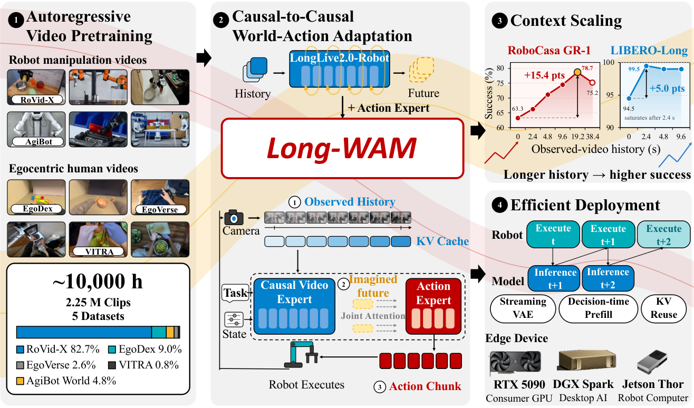
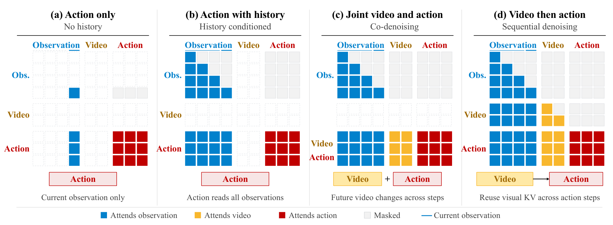
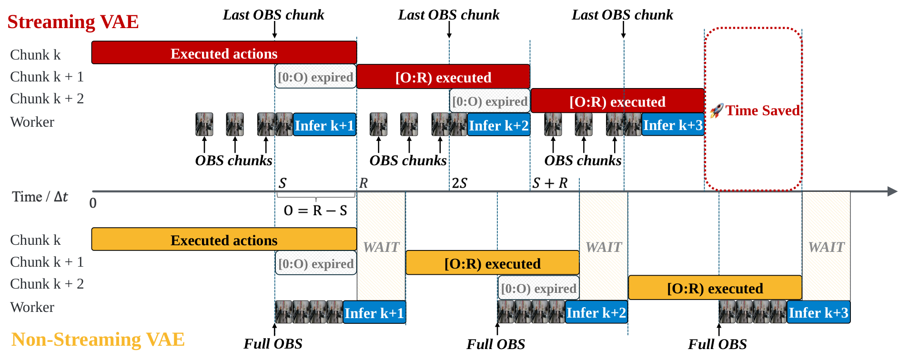

# Long-WAM: Scaling the Context of World-Action Models

检索截至 **2026-10-09 02:02:07（北京时间，UTC+08:00）**；主窗口为 2026-10-06 02:02:07 至截止时刻，未启用七天回退。按仓库既有日报的基础 arXiv ID、标题和官方地址比对，以下两项尚未报道。Long-WAM 的 [arXiv v1 记录](https://arxiv.org/abs/2610.10528)为 10 月 7 日 17:58:04 UTC **提交**，提交时刻不能直接当作公众可读时刻；[作者代码仓库](https://github.com/NVlabs/LongLive/tree/main/Long-WAM)的发布记录标为 10 月 7 日，而 [cs.RO 新列表](https://arxiv.org/list/cs.RO/new)在 10 月 8 日列出论文，后两者分别提供日期精度的项目公开记录与论文公开证据。检索与文中数值均以论文 v1 和作者项目页为准。

## 今日精选

| 工作 | 可核实公开证据 | 关注点 |
|---|---|---|
| **首推** · [Long-WAM: Scaling the Context of World-Action Models](https://arxiv.org/abs/2610.10528) | [作者项目](https://nvlabs.github.io/LongLive/Long-WAM/)与 10 月 8 日 cs.RO 公开列表 | 怎样把更长的观测历史变成有用的未来预测，再把预测转成来得及执行的动作。 |
| [Workhorse: Learning Robust Whole-Body Humanoid Loco-Manipulation from Human Data](https://arxiv.org/abs/2610.09117) | [作者项目及技术说明](https://hybridrobotics.github.io/workhorse/)；10 月 8 日 cs.RO 公开列表 | 从人类示教学视觉规划，用强化学习训练全身跟踪，并处理两层策略在部署时相互引入的误差。 |

[Workhorse](https://hybridrobotics.github.io/workhorse/)用五个可穿戴跟踪器记录躯干、双腕和双足位姿，配合胸前视频采集无需机器人参与的示教。视觉规划器根据图像与身体运动历史预测目标片段，全身跟踪器负责把目标变成机器人动作。关键在于训练规划器时模拟跟踪误差、训练跟踪器时模拟规划偏差，避免两者各自在理想输入上学好、组合后却不断积累误差。项目展示 G1 箱子整理、接箱和手提箱操作，但真机展示未给统一成功率分母，不能把仿真抗扰动消融直接当作真机结论。

## 动机：机器人缺的究竟是历史，还是利用历史的能力？

设想机械臂要从传送带上拿起杯子。一张图能告诉它杯子在哪里，却不能唯一确定杯子向哪边移动、速度多快；同一位置可能对应不同的运动状态。再看“拿起杯子、套进另一个杯子”这样的连续任务，当前画面也未必能区分动作处于哪个阶段。历史因此提供两类信息：短时间内的运动线索，以及跨阶段的交互进度。**Long-WAM 关心的是：怎样让策略从这些历史里提取下一步动作真正需要的信息，而不是仅仅保存更多画面。**

已有世界—动作模型（World-Action Model，WAM）把视频预测与动作生成结合，但视频底座的训练方式不一定贴合机器人部署。双向视频生成器可以在一个视频块内综合前后位置的信息；机器人在线决策时则只能拿到已经发生的观测，必须由过去推断未来。DreamZero、LingBot-VA 等工作在动作适配阶段建立因果接口，Long-WAM 则进一步把这种“历史→未来”的组织方式提前到视频预训练。这里的“因果”指时间上的信息可见性，不意味着模型已经识别了物理因果机制。

另一个瓶颈来自时间：历史越长，视觉编码和注意力计算越重；如果等预测完成时杯子已经移动，较好的预测也可能失去控制价值。因此文章的设计有一条连续主线：先学会根据历史预测交互，再让动作利用这个预测，最后把整个过程放进闭环控制的时间预算。它研究的是这三步怎样配合，不是单独提出一种更大的记忆缓存。[原文 §1–3](https://arxiv.org/html/2610.10528v1#S3)

## 沿框图理解：从观察过去到生成动作

*图 1｜原文 Figure 1，Long-WAM 整体框架。左侧是无动作标签的视频预训练；中间上方把视频模型适配为 WAM，中间下方才是一次控制决策的信息流：观测历史进入视频专家，预测出的未来表征交给动作专家，后者生成动作块，执行后再收集观测。右下角说明推理怎样与执行重叠；右上角是对历史长度的实验检验，不是额外网络模块。来源：[论文 v1 Fig. 1](https://arxiv.org/html/2610.10528v1#S0.F1)，[官方 HTML 原图](https://arxiv.org/html/2610.10528v1/1_2.png)，CC BY 4.0。*

读中间的闭环时，可以把两个专家的分工理解为：视频专家回答“在当前任务和历史下，交互接下来可能怎样发展”，动作专家回答“为了产生这样的变化，现在应输出哪一段动作”。实际输入包括观测视频的潜变量 $Z_t^-$、当前机器人本体状态 $q_t$ 和语言指令 $c$。潜变量是视频经变分自编码器（Variational Autoencoder，VAE）压缩后的特征，不是物体位姿或手写物理状态。输出 $\widehat{\mathbf A}_t$ 是未来 $H$ 个控制步的动作块，执行一部分后再用新观测决策。

两者之间传递的是**预测未来的视觉特征及注意力键值缓存**，无需先生成一段可观看的视频。原文式 (3) 把这条路径写为：

$$
\begin{aligned}
\widetilde Z_t^+ &= \operatorname{Rollout}_{\theta,\sigma_\star}(\epsilon^v\mid Z_t^-,c,q_t),\\
\mathcal K_t &= \operatorname{Prefill}_{\theta}(Z_t^-,\widetilde Z_t^+;c,q_t,\sigma_\star),\\
\widehat{\mathbf A}_t &= \operatorname{Denoise}_{\psi}(\epsilon^a\mid\mathcal K_t,c,q_t).
\end{aligned}
$$

第一行由参数为 $\theta$ 的视频专家从高斯噪声 $\epsilon^v$ 出发，预测到噪声水平 $\sigma_\star$，得到部分去噪的未来潜变量 $\widetilde Z_t^+$。第二行把过去与预测未来编码为各层注意力的键和值，合称 $\mathcal K_t$；Prefill 就是预先计算这份视觉条件。第三行由参数为 $\psi$ 的动作专家从另一份噪声 $\epsilon^a$ 生成动作。历史始终是干净的真实观测，未来则是模型的预测。以下三步分别解释这条计算链怎样学会、怎样使用、怎样按时完成。

### 先用视频学会“由过去推未来”

第一阶段从 LongLive-2.0 的自回归（Autoregressive，AR）视频检查点继续训练，得到 LongLive2.0-Robot。数据来自 RoVid-X、AgiBot World、EgoDex、EgoVerse 和 VITRA，包含机器人和第一人称人类视频。这里不需要动作标签，所以不同机器人不必拥有同一种关节定义，人类视频也能参与训练。约 225 万训练样本按每段 16 秒折算约一万小时；这是窗口累计时长，不能解释成一万小时不重叠的原始录像。[§3.1、附录 B.1](https://arxiv.org/html/2610.10528v1#A2)

“自回归”在这里不是一帧接一帧地做普通回归。视频先被切成潜变量块，模型预测一个带噪块时只能读取它之前的历史和该块自身的带噪特征，不能读取后续块或当前块的干净答案。训练用 teacher forcing，即先提供真实历史，再监督模型恢复下一个块；块因果注意力让多个目标块可以并行训练而不泄露未来。最长约 30 秒的视频序列迫使模型面对较长的运动与交互上下文。相比仅在动作训练时加一个因果掩码，这一步直接在大量视频上学习部署时所需的时间依赖。

另一个细节是 error recycling：把缓冲的模型误差作为扰动加到部分训练输入，恢复目标仍保留原始干净内容。直观上，如果模型只见过完美历史，一旦自身预测有误，后续预测会继续漂移；让它在训练时接触类似误差，有助于学习纠偏。这沿用了视频底座的机制，并不是 Long-WAM 新发明的控制器。此阶段学到的是机器人交互的视觉预测先验，还没有学会可执行的动作。

### 再让动作专家读取“部分预测的未来”

加入动作专家后，模型必须把视觉变化和示教动作联系起来。Long-WAM 使用不对称注意力：视频专家只能读取自身及更早的视觉块，不能读取动作 token；动作专家可以读取观测历史、预测未来和整个带噪动作块。这样保留了视频预训练的时间结构，又为动作补上“预计会发生什么”的条件。[§3.2、附录 B.2](https://arxiv.org/html/2610.10528v1#A2.SS2)

*图 2｜原文 Figure 2。矩阵的行是读取信息的一方，列是被读取的内容，灰格表示屏蔽；蓝、黄、红分别对应观测、未来视频、动作。重点看 (d)：视频行的动作列被屏蔽，动作行却能读历史与未来视频；下方箭头明确先视频、后动作。对照 (b) 可看到“有历史但不预测未来”缺少的条件，对照 (c) 可看到联合去噪会持续改变未来表征。来源：[论文 v1 Fig. 2](https://arxiv.org/html/2610.10528v1#S2.F2)，[PDF 第 3 页](https://arxiv.org/pdf/2610.10528v1#page=3)原图区域清晰裁取，CC BY 4.0；未重绘内容。*

为什么称为逆动力学建模（Inverse Dynamics Modeling，IDM）？因为动作生成以“已经观察到的状态变化线索”和“希望/预计到达的未来视觉状态”为条件，学习连接两者的动作。它不需要在部署时解一个手写动力学方程。以移动杯子为例，历史提供运动方向和速度线索，预测未来表征提供交互延续的条件，再由动作专家综合这些条件输出抓取动作。这里是对模块作用的解释，不能把它理解为论文显式估计了杯子的速度数值，或在多个动作方案间做模型预测控制搜索。

动作适配采用两次前向计算。第一次以干净观测为条件训练未来视频；第二次把**真值未来**加噪到 $\sigma_\star=0.9$，用历史与该未来建立视觉缓存，再监督动作生成。两条分支都用流匹配：将干净数据 $x$ 与高斯噪声 $\epsilon$ 混成 $x^\sigma=(1-\sigma)x+\sigma\epsilon$，网络学习噪声与数据之间的速度方向 $\epsilon-x$。推理时沿噪声水平下降的方向积分，逐渐得到输出。这里的“速度”是生成过程在数据空间中的方向，不是机械臂的物理速度。

原文附录式 (6) 对视频与动作分支统一给出：

$$
\begin{aligned}
\mathcal L_b &= \mathbb E\!\left[w_b(\sigma_b)\frac{\|m_b\odot r_b\|_2^2}{\max(\|m_b\|_1,1)}\right],\\
r_b &= v_b(x_b^{\sigma_b},\sigma_b\mid\mathrm{conditioning})-(\epsilon_b-x_b).
\end{aligned}
$$

其中 $b\in\{v,a\}$ 区分视频和动作，$v_b$ 是该分支预测的生成速度，$r_b$ 是预测误差，$w_b$ 是噪声调度权重。掩码 $m_b$ 排除补齐的未来帧或动作步，$\odot$ 表示逐元素相乘，分母按有效元素数归一化。总损失为 $\mathcal L=\lambda_v\mathcal L_v+\lambda_a\mathcal L_a$，两个系数平衡分支。动作这次计算中的视觉缓存会被 detach，即截断梯度：动作损失更新动作专家和本体状态适配器，不通过缓存反传视频专家；视频专家仍由前一次视频损失训练，不能说整个视频底座始终冻结。

部署时没有真值未来。视频专家从噪声出发做四步部分生成，在 $\sigma_\star=0.9$ 停止，然后动作专家在固定视觉条件下去噪。按上述参数化，0 表示干净数据、1 表示纯噪声，因此 0.9 仍是高噪声潜变量，不能描述成清晰预测视频。作者的取舍是：只求足够指导动作的预测特征，不花计算把它还原成精细像素。训练未来含真值成分、部署未来完全来自预测，两者噪声水平相同却分布不完全相同，这是需要保留的近似边界。

固定未来条件还有计算上的好处：动作去噪的多次迭代可以复用同一份视觉缓存。但这种复用主要限于**当前一次动作求解**。下一次决策中，本体状态、历史窗口和时间位置发生变化，原视觉键值可能失效，需要按正确的对齐关系刷新；不能把论文的缓存优化概括成永久保留所有旧计算。

### 最后让预测赶上机器人正在执行的动作

若机器人必须停下来等“视频预测→动作去噪”，系统即使预测准确，也难以处理传送带上的动态目标。Long-WAM 因而在旧动作块执行期间生成新动作块：新块及时到达时，丢弃已经过时的前缀，按绝对控制时刻执行对齐后的后缀。文中的纯异步方案不额外混合两段动作，也不用上一块前缀强制引导生成；这是实验上可行的设计，不构成连续性保证。

*图 3｜原文 Figure 3。上半部分边执行边编码新观测，在切换期限前备好下一块；下半部分等触发后再编码整个窗口，黄色动作块之间出现 WAIT。灰色的 expired 是新预测里已经过时、不再执行的前缀；这张图解释的是减少等待的方法，不是成功率曲线。来源：[论文 v1 Fig. 3](https://arxiv.org/html/2610.10528v1#S3.F3)，[PDF 第 5 页](https://arxiv.org/pdf/2610.10528v1#page=5)原图区域清晰裁取，CC BY 4.0；未重绘内容。*

设每块前 $R$ 步可供执行，每隔 $S$ 步触发一次新推理，重叠量为 $O=R-S$，每个控制步间隔为 $\Delta t$。新动作准备耗时 $T_{\mathrm{ready}}$ 包括传输、排队和计算。原文式 (4) 给出的按时交接条件是：

$$
T_{\mathrm{ready}}\leq O\Delta t=(R-S)\Delta t.
$$

例如论文测试过 $R=24,S=16$，留给交接的窗口就是 8 个控制步。更晚触发可以看到更新鲜的观测，却也只剩更短的计算时间。流式 VAE 的作用是把此前已经到达的帧提前编码，触发后只处理剩余部分，减少关键路径上的工作；它与异步执行共同解决“既想看得新，又要来得及”的矛盾。控制器逐步执行动作的频率，与模型多久重新生成一块动作，是两个不同量。

其余加速围绕减少重复计算展开：视频分支采用 NVFP4 四位权重与激活，动作计算和键值缓存保留 BF16；配合编译、CUDA Graph 和设备相关内核优化降低开销。论文报告 RTX 5090 在 2.4 秒历史下约 107.4 ms 生成一块，19.2 秒历史增至 341.0 ms。该计时包含观测 VAE，却排除了文本编码和控制器等开销，所以仍须用上面的就绪条件判断能否闭环，不能直接把时延倒数当作机器人控制频率。[§4、附录 F–G](https://arxiv.org/html/2610.10528v1#A6)

## 实验只回答两个核心问题

历史和未来预测是否真的有用？作者在固定预测跨度与动作长度的条件下分别训练不同历史窗口的模型。RoboCasa GR-1 中，机器人域 AR 初始化在 19.2 秒历史达到 78.7%，双向初始化为 61.6%；这支持“预训练方式影响历史的利用价值”。但 38.4 秒反而降到 75.2%，该窗口约 80.4% 是起始帧补齐。另一个直接消融是 LIBERO-Long：无未来预测为 94.5%，先预测未来再生成动作的 IDM 为 99.5%。这些是模拟基准证据；原文 Table 4 与 §5.3 对 GR-1 的 2.4 秒起点分别写 63.3% 和 66.3%，这里不据此计算确定增益。[§5.3、Table 1/4、Fig. 6](https://arxiv.org/html/2610.10528v1#S5.SS3)

这条较重的生成链能否上真机？G1 在移动杯子叠放任务中成功 19/20，$\pi_{0.5}$ 与 Fast-WAM 均为 0/20，说明作者实现的整套系统能够应对这一动态操作设置。但它不能单独隔离长历史、未来预测和部署优化各自贡献，论文尚未在真机上完整复现逐档历史长度消融。需要区分“系统能工作”和“每个设计的独立收益已证明”。[§6.1、Fig. 7](https://arxiv.org/html/2610.10528v1#S6.SS1)

## 这项工作的边界

Long-WAM 把历史变成预测条件，再把预测条件变成动作，清楚展示了视频模型如何服务控制；它没有证明历史越长越好，也没有得到普适的上下文 scaling law。当前不同窗口分别训练，尚不是一个能在部署时自由调节记忆长度的策略。训练动作时使用带噪真值未来的近似、长窗口中真实历史稀疏，以及约 30,720 H100 GPU 小时的视频预训练成本，都限制了结论的外推与复现。

更长的物理交互历史也不等于完整的高层任务记忆。论文还把 Long-WAM 接在语言规划器下执行子任务，但那是层次系统的结果：任务分解与局部执行需要分别评价。读这篇工作最有价值的线索，是把**预测所需的历史、动作所用的未来表征、以及真实执行的时间预算**放在同一条方法链上检查。[原文讨论与附录 A](https://arxiv.org/html/2610.10528v1#A1)
